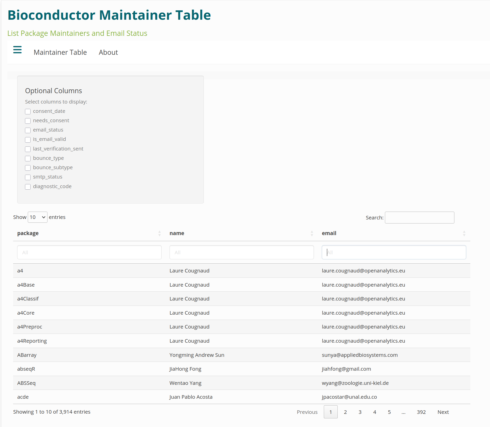
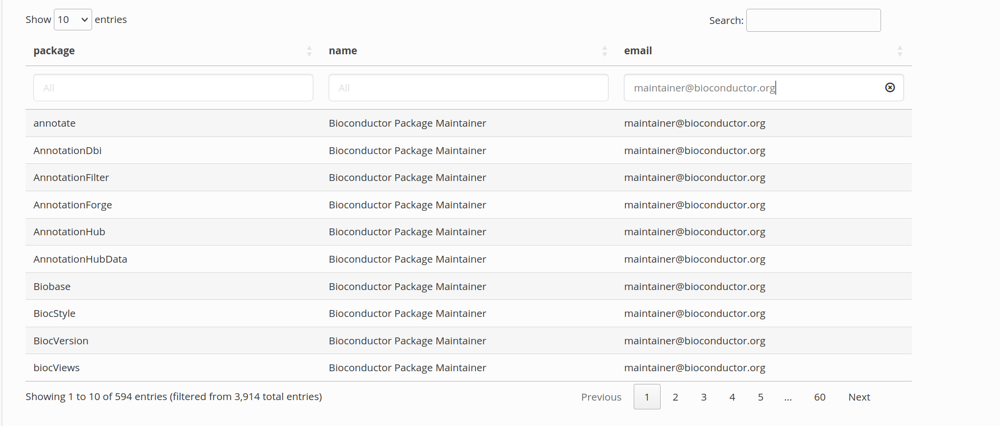
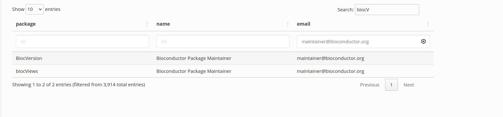
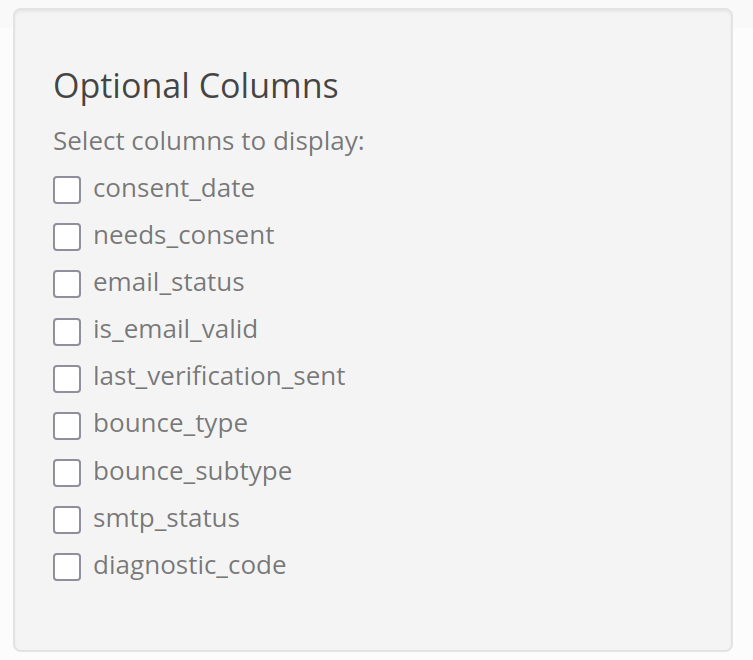

```{r setup, include=FALSE,echo=FALSE}
knitr::opts_chunk$set(
    collapse = TRUE,
    comment = "#>",
    cache = TRUE,
    out.width = "100%"
)
```

# Background

The BiocMaintainerShiny App is an accompaniment to the Bioconductor Maintainer
Validation App. It displays a list of the currently active Bioconductor
packages and their maintainers.  The Bioconductor Maintainer Validation App
sends a reminder email to maintainers of Bioconductor policies and
procedures. Maintainers are required to opt-in to the Bioconductor policies once
a year. This shiny app also shows information if the maintainer has opted in to
the Bioconductor policies and whether the email provided is reachable.


# Installation

```{r install, eval=FALSE}
if (!requireNamespace("BiocManager", quietly = TRUE))
    install.packages("BiocManager")

BiocManager::install("BiocMaintainerApp")
```


# Loading the package 

```{r load, include=TRUE,results="hide",message=FALSE,warning=FALSE}
library(BiocMaintainerApp)
```

# Launching the Shiny Application

```{r launch, eval=FALSE}
BiocMaintainerShiny()
```

```{r overviewpic, echo=FALSE}

```

# Filtering

Columns can be filtered using the search box above the respective column. For
example, you can search for a maintainer email to see the packages associated
with that email

```{r filterpic, echo=FALSE}

```

The general search box can filter across all columns and be used solely or in
addition to columns filters. For example adding a filter for `biocV`

```{r searchpic, echo=FALSE}

```

# Optional Columns

The default columns shown are:

- package
- name
- email

Optional columns can be select from the selection box. The selection box can be
hidden or shown using the sandwich icon.

```{r optcolpic, echo=FALSE}

```

Optional columns include:

- consent_date
- needs_consent
- email_status
- is_email_valid
- last_verification_sent
- bounce_type
- bounce_subtype
- smtp_status
- diagnostic_code

The following provide brief descriptions of columns:

- **package:** name of Bioconductor package
- **name:** maintainers name
- **email:** maintainers provided email in package DESCRIPTION
- **consent_date:** last known consent date to Bioconductor policies
- **needs_consent:** quick filter if consent_date is over a year
- **email_status:** (Initialized, valid, suppressed, bounce, new)
- **is_email_valid:** true/false if the email could be delivered
- **last_verification_sent:** when was the last verification email sent

The remaining columns are utilized if additional information when an email is
bounced can be retrieved. This is used as potential diagnostic and resolution.

# Session Info

```{r sessioninfo}
sessionInfo()
```
